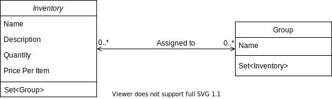
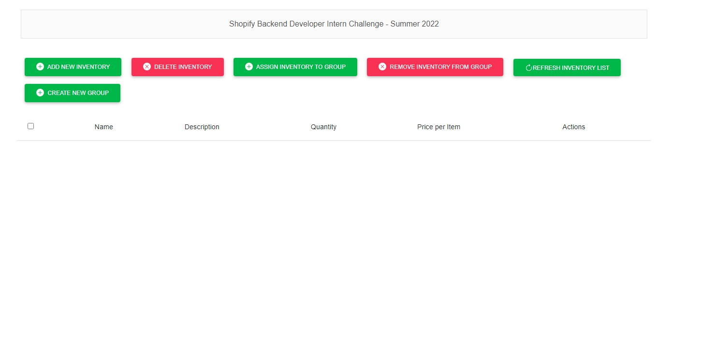

# Shopify Backend Developer Intern Challenge - Summer 2022

## Project Dependencies

Project has below dependencies:
- Java JDK 11
- Maven 3.6.3
- Spring Boot 2.6.2
- PostgreSQL

## Features Implemented

Along with the CRUD functionalities, this project also implements the **ability to assign/remove inventory items to a named group/collection** as mentioned in the [Shopify Backend Developer Intern Challenge](https://docs.google.com/document/d/1z9LZ_kZBUbg-O2MhZVVSqTmvDko5IJWHtuFmIu_Xg1A/).

## Technologies/Libraries Used
All the libraries and dependencies can be found in `pom.xml` file. Below are the major ones:

- Spring Boot
- JPA
- Spring Validation
- PostgreSQL
- Thymeleaf
- Lombok
- JUnit 5

## Design
This project uses JPA to define a bi-directional many-to-many relationship between `Inventory` class & `Group` class where an inventory can be assigned to zero or more groups and a group can have zero or more inventories in it. Below is the class diagram:



## About the Code

### Back-end

- All the repositories are defined in `repository` package.
- All the controllers are defined in `controller` package.
  - JavaDocs are available on each controller.
  - There is a central `ExceptionHandlingController` where all the exception handling logic is defined for the entire server.
- All the services/business_logics are defined in `service` package.
- All the custom exceptions are defined in `exception` package.
- All the DTOs are defined in `dto` package.
- All the models are defined in `model` package.
- Junit tests are written for each service.

### Front-end
Front-end uses a combination of HTML, CSS, Bootstrap, JQuery and AJAX for its functionality.

## Running the application locally
- Install PostgreSQL.
- Create a database and update the details in `application.properties` file. For starter, you can create a db with `imsdb` name.
- The easiest way to run this project is to download [IntelliJ IDEA](https://www.jetbrains.com/idea/download/) and open this project by using `File -> Open -> InventoryManagementSystem`. It will take a couple of minutes to download all the dependencies using maven. Once they are downloaded run `ImsApplication`.

**Project URL:** [http://127.0.0.1:8080/](http://127.0.0.1:8080/)

**Homepage:**


## How to?
- Create Dummy data by opening [http://127.0.0.1:8080/dummyData](http://127.0.0.1:8080/dummyData).
- Click on **Refresh Inventory List** Button to view dummy data.
- Add Inventory by clicking on **Add New Inventory** Button. You'll have to click on **Refresh Inventory List** to view the newly added inventory.
- Add Group by clicking on **Create New Group** Button.
- Individual Inventory can be edited or deleted by clicking on respective icon in the row under **Actions**. You'll have to click on **Refresh Inventory List** to view the updated inventory list.
- All the groups an individual Inventory is assigned to can be viewed by clicking the last icon in the row under **Actions**.
- From the above list of groups, individual group can be removed by clicking on **delete**. You'll have to dismiss the modal and view groups again to see the updated group list.
- Multiple Inventories can be deleted by selecting their checkboxes and clicking on **Delete Inventory** Button.
- Multiple Inventories can be assigned/removed from multiple groups by selecting the checkboxes of inventory list and then clicking on **Assigned Inventory to Group** or **Removed Inventory From Group** button.
  - This is a powerful option as it always updates and ignores when no action is required or if it doesn't exist.
  - For example, if the inventory is already assigned to a group, and you try to assign it again, it's going to ignore this assignment.
  - For example, if you select two inventories (`x`, `y`) and two groups (`p`, `q`) and one inventory (`x`) is already assigned to one group (`p`), then on clicking **Assigned Inventory to Group** button inventory `x` will be assigned to `q` and inventory `y` will be assigned to both `p` & `q`. It will ignore the assignment of inventory `x` to group `p` as it already exist.
  - **Removed Inventory From Group** button works the same way.

### Add Group

### 

## List of APIs supported by back-end
- Create new inventory.
    - API: /inventory/new 
    - Method: POST
    - Request JSON Body:     
  ```json
  {
    "name": "dummy inventory",
    "description": "description of dummy inventory",
    "quantity": "5",
    "pricePerItem": "20.0"
  }
    ```
  
- Delete inventory.
  - API: /inventory/delete
  - Method: POST
  - Request JSON Body:
  ```json
  {
    "inventoryIds": ["<inventoryId>", "<inventoryId>"]
  }
    ```
  
- Update inventory.
  - API: /inventory/update/&lt;inventoryId&gt;
  - Method: POST
  - Request JSON Body:
  ```json
  {
    "name": "updated dummy inventory name",
    "description": "description of dummy inventory",
    "quantity": "5",
    "pricePerItem": "20.0"
  }
    ```
  
- List of Inventories.
  - API: /inventory/all
  - Method: GET
  
- Get Inventory by ID.
  - API: /inventory/get/&lt;inventoryId&gt;
  - Method: GET

- Get Groups of an Inventory.
  - API: /inventory/getGroups/&lt;inventoryId&gt;
  - Method: Get

- List of Groups.
  - API: /group/all
  - Method: GET

- Get Group by ID.
  - API: /group/get/&lt;groupId&gt;
  - Method: GET

- Create new Group.
  - API: /group/new
  - Method: POST
  - Request JSON Body:
  ```json
  {
    "name": "dummy group"
  }
    ```
  
- Assign Groups To Inventories.
  - API: /group/assignGroupsToInventories
  - Method: POST
  - Request JSON Body:
  ```json
  {
    "groupIds": ["<groupId>", "<groupId>"],
    "inventoryIds": ["<inventoryId>", "<inventoryId>"]
  }
    ```

- Remove Inventories From Groups.
  - API: /group/removeInventoriesFromGroup
  - Method: POST
  - Request JSON Body:
  ```json
  {
    "groupIds": ["<groupId>", "<groupId>"],
    "inventoryIds": ["<inventoryId>", "<inventoryId>"]
  }
    ```

- Delete Group by ID.
  - API: /group/delete/&lt;groupId&gt;
  - Method: POST

- Get All Inventories in a Group.
  - API: /group/getInventories/&lt;groupId&gt;
  - Method: Get

- Create Dummy Data for testing.
  - API: /dummyData
  - Method: GET

**Note:** A postman collection is available with all the APIs.